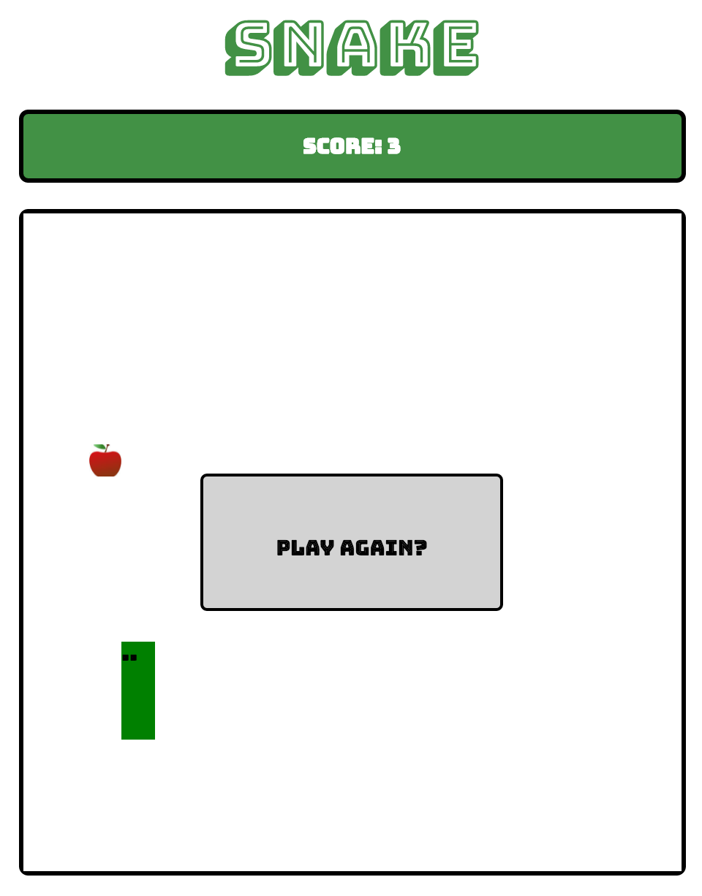

# Reddit Clone

## Overview
The purpose of this project was to learn to use jQuery to manipulate the DOM and to demonstrate object oriented programming using JavaScript.  

## Dependencies
None

## Installation and Setup
1. Download or clone repository to local machine.
2. Navigate to project folder.
3. Open index.html in your browser.

## Example Screenshot

